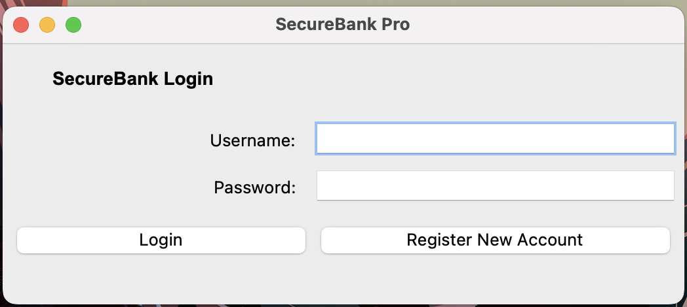
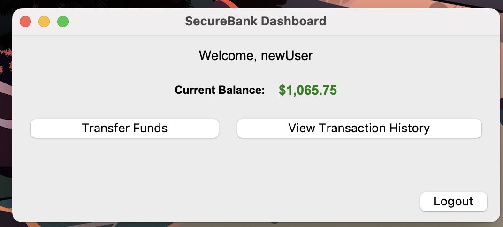
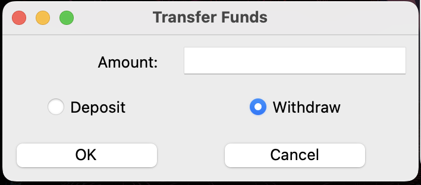
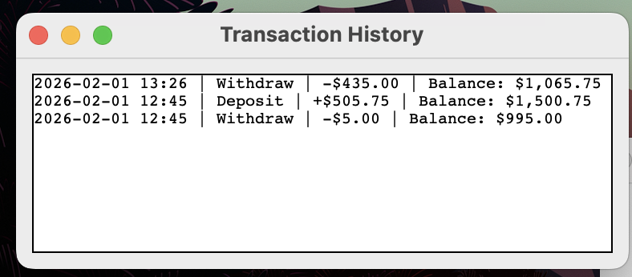

# 🛠️ Design Specification: SecureBank Pro
 
| Field | Value |
|---|---|
| Author | Kirsten Hart |
| Document Status | Ready for review |
| Release Date | Early May 2026 |
| Design Review (Date & Status) | March 23, 2026 |

## Purpose
The goal of SecureBank is to provide users with a secure way to manage core banking operations. It allows for the creation of customer profiles and the management of associated bank accounts, enabling users to check balances and perform basic financial data retrieval.

## 1. User Analysis & Use Cases
**Intended User:** The app is designed for individuals seeking a local, lightweight tool to simulate personal financial tracking or for developers looking to understand Python GUI and state management.

**Primary Goals:**
- Securely manage a digital "ledger" of funds.
- Track balance changes over time with timestamps.
- Ensure data persists between application sessions.

**Key Use Cases:**
- New Account Setup: A user registers with a username and password to initialize a \$1,000.00 starting balance.
- Funds Management: A user deposits or withdraws specific amounts through a dedicated dialog.
- Audit Trail: A user reviews a chronologically sorted history of transactions to verify spending.

## 2. Requirements & Feature Priority

| **ID** | **Description** | **Priority** |
|---|---|---| 
| RQ1 | **Data Persistence**: Account data, balances, and history must be saved to a local `users.json` file. | Must have |
| RQ2 | **Password Hashing**: Passwords must never be stored in plain text; SHA-256 hashing is required for authentication. | Must have |
| RQ3 | **Transaction Logic**: The system must prevent withdrawals that exceed the current balance. | Must have | 
| RQ4 | **Responsive GUI**: The interface must adjust to different window sizes using weight-based scaling. | Must have | 
| RQ5 | **Running Balance**: The history view calculates and displays the balance as it was at the time of each transaction. | Nice to have | 
| RQ6 | **Transaction Type Filtering**: Ability to distinguish between "Deposit" and "Withdraw" in the logs. | Nice to have | 
| RQ7 | **Dynamic UI Updates**: The dashboard must refresh its balance display immediately after a transaction without a restart. | Nice to have |

## 3. Architectural Design
The application follows a component-based architecture to separate concerns and improve maintainability.
| **Component** | **File** | **Responsibility** | **Requirement** |
|---|---|---|---| 
| Main App | `main.py` | 1. Handle app entry and authentication.   2. Build the user Login view. | | 
| Authentication | `auth.py` | 1. Validate user credentials and handle registration logic.   2. Hash passwords.   3. Standardize file I/O operations (read and write to `users.json`).   4. Ensure that data modifications in the Dashboard view are correctly serialized back to disk. | RQ2 | 
| User Dashboard | `dashboard.py` | 1. Manage the user-specific session and transaction dialogs.   2. Build the user Dashboard view. | | 
| User Data (backend) | `users.json` | 1. Store user data (username, password, balance, transaction history). | RQ1 |

When the user first opens the application:
- The user enters a username and password into the `Entry` widgets in `main.py`.
- **Registration:**
  - If the user clicks "Register," `main.py` calls `auth.register_user`.
  - `auth.py` checks `users.json` to see if the username already exists.
  - If unique, the password is hashed via `hashlib.sha256` and saved to the JSON file with a default \$1,000 balance.
- **Login:**
  - If the user clicks "Login," `main.py` calls `auth.authenticate_user`.
  - `auth.py` hashes the input password and compares it against the hash stored in `users.json`.
  - On a match, `main.py` closes the login inputs and initializes the `BankDashboard` class.

Once authenticated, the user moves into the persistent session managed by `dashboard.py`.
- The `BankDashboard` retrieves the user's specific dictionary (balance and history) from the data loaded via `auth.py`.
- The user opens the `Transfer Funds` dialog and enters an amount.
- **Validation Logic:**
  - The app attempts to parse the input as a float.
  - It checks that the amount is a positive value.
  - For withdrawals, it verifies the current balance in `users.json` is sufficient.
- **Data Serialization:**
  - The balance is updated in memory.
  - A new dictionary entry containing the type, amount, and `datetime` timestamp is added to the "history" list.
  - `auth.save_data` is called to overwrite `users.json` with the new state.
- The `balance_var` in the dashboard is updated, triggering an immediate visual change for the user.

## 4. User Interface Design
**SecureBank Pro App** (built in `main.py`)

**SecureBank Dashboard** (built in `dashboard.py`)

**Transfer Funds** (built in `dashboard.py`)

**Transaction History** (built in `dashboard.py`)

## 5. Future Considerations
To evolve SecureBank Pro into a production-ready simulation, the following features are will be considered in the next version:
- **Relational Database:** Migrating from `users.json` to SQLite to better handle concurrent access and complex queries.
- **Multi-Factor Authentication (MFA):** Adding a secondary verification step (e.g., a pin or email code) during the login process.
- **Inter-User Transfers:** Allowing a logged-in user to send funds to another username existing in the system.
- **Data Visualization:** Integrating `matplotlib` to show spending trends or monthly balance graphs.
- **Session Timeout:** Implementing a background timer that automatically logs the user out after a period of inactivity for enhanced security.

## 6. File Structure
Implemented in Python, this app requires the import of Tkinter for building the graphical user interface.

In the `/dev/kirstenh/workshop/src/` directory:
- `main.py` requires import of `tkinter`, `auth` (from `auth.py`), and `dashboard` (from `dashboard.py`).
- `auth.py` requires import of `json`, `os`, and `hashlib`.
- `dashboard.py` requires import of `tkinter` and `auth`.
