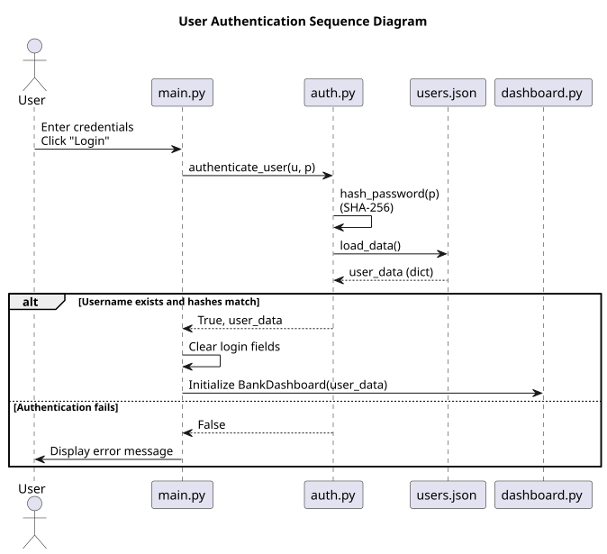
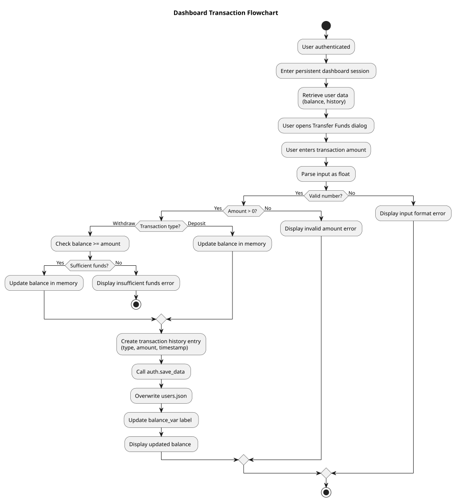
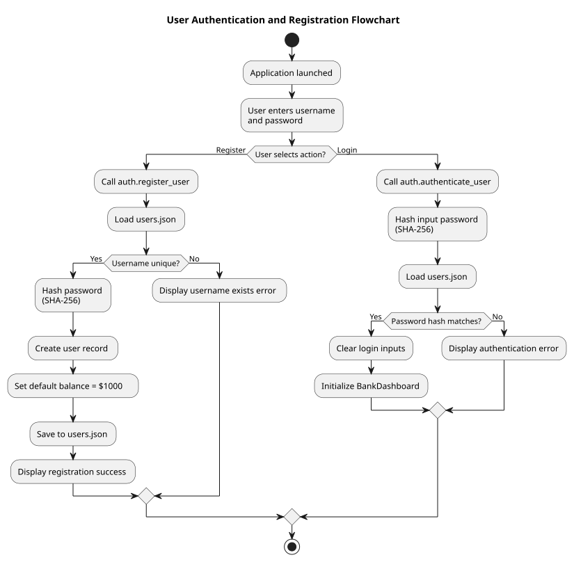

# 📊 Appendix: Diagrams
## Sequence Diagrams
To visualize how SecureBank Pro handles your data and user interface transitions, we can break the interaction down into a sequence diagram. This represents the interactions happening between your files behind the scenes.

This diagram tracks the lifecycle of a user session, from the initial login attempt in `main.py` to a balance update in `dashboard.py`.
### 1. User Authentication
- User Action: The user enters credentials into the `Entry` widgets and clicks the "Login" button.
- Login Request: `main.py` calls `auth.authenticate_user(u, p)`.
- Security Processing: `auth.py` hashes the provided password using SHA-256 via `hash_password(p)`.
- Data Verification: `auth.py` calls `load_data()` to read the current `users.json` file.
- Success Response: If the username exists and the hashes match, `auth.py` returns `True` and the `user_data` dictionary to `main.py`.
- UI Transition: `main.py` clears the login fields and initializes the `BankDashboard` class from `dashboard.py`.

### 2. The Transaction Phase
- User Action: The user clicks "Transfer Funds" in the dashboard, chooses "Withdraw," and enters an amount.
- Input Validation: `dashboard.py` parses the input as a float and ensures it is a positive value.
- Logic Execution: `dashboard.py` calls `_perform_transaction()`, which retrieves the latest data from `auth.load_data()`.
- Balance Check: The system verifies if the current balance in `users.json` is greater than or equal to the withdrawal amount.
- State Update: `dashboard.py` subtracts the amount, generates a timestamped history log, and calls `auth.save_data()` to update `users.json`.
- UI Refresh: The dashboard updates the `balance_var` label to reflect the new total instantly.

## Activity Diagrams

The activity diagrams illustrate the primary control flows governing user access and transactional behavior within the system. 

### 1. Authentication and Registration Flow

The Authentication and Registration Flow begins when the application is launched and the user provides credentials. At this point, the system branches based on the user’s selected action: registration or login. In the registration path, the system validates username uniqueness against the persisted user data, securely hashes the provided password using a cryptographic hashing function, initializes a new user record with a default account balance, and serializes the updated state to persistent storage. In the login path, the system hashes the entered password and compares it against the stored hash to authenticate the user. Successful authentication transitions the application from the login interface into the dashboard session, while failure conditions terminate the flow with appropriate user feedback. This diagram emphasizes decision points, validation logic, and secure handling of credentials prior to session establishment.

### 2. Dashboard and Transaction Flow

The Dashboard and Transaction Flow diagram models the behavior of the system once an authenticated session has been established. Upon initialization of the dashboard, the system retrieves the authenticated user’s account data, including balance and transaction history. When the user initiates a transaction, the system validates the entered amount by ensuring it is a valid numeric value and greater than zero. For withdrawal operations, an additional guard verifies that sufficient funds are available before allowing state modification. Once validation succeeds, the system updates the account balance in memory, appends a timestamped transaction record to the user’s history, and persists the modified state to storage. The flow concludes with an immediate user interface refresh, ensuring that the displayed balance accurately reflects the committed transaction.

Together, these diagrams clearly delineate control flow, validation checkpoints, and state transitions, providing a concise behavioral overview of both session initialization and transactional processing within the application. 
